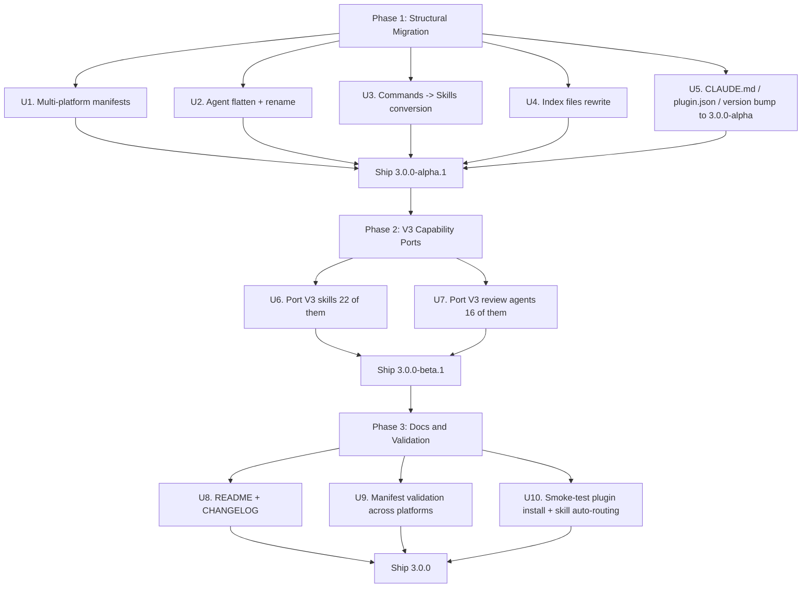

# feat: Migrate sf-compound-engineering-plugin to V3 architecture

## Overview

Bring `sf-compound-engineering-plugin` to architectural parity with EveryInc's `compound-engineering-plugin` v3.0.6 while preserving its Salesforce identity. V3 is a breaking restructure: it eliminated the `commands/` directory entirely (skills now serve as user-invocable workflows via `/ce-<name>` syntax), renamed every agent to `<name>.agent.md` with a flat layout under `agents/`, adopted the `ce-` prefix as a stable namespace, and added per-platform manifests for Cursor and Codex alongside the Claude one.

The current plugin is at v2.2.0 and tracks the **v2.x model**: 7 commands in `commands/`, 35 categorized agents under `agents/{apex,architecture,automation,integration,lwc,research,workflow}/`, 16 skills, no `.cursor-plugin` or `.codex-plugin` manifests, no V3 capability skills (`ce-debug`, `ce-ideate`, `ce-optimize`, `ce-pr-description`, `ce-resolve-pr-feedback`, `ce-update`, `ce-setup`, `ce-sessions`, `ce-doc-review`, etc.). The teardown that motivated this migration was based on the older v2.38.1 snapshot and predates the V3 breaking changes.

This plan migrates the plugin to **v3.0.0** in three phases: (1) structural — convert commands to skills, flatten and rename agents, add multi-platform manifests; (2) capability — port the 22 V3-only skills and 16 V3-only agents that have direct Salesforce relevance, all `sf-` prefixed; (3) routing/docs — rebuild the index files, CLAUDE.md, README, marketplace.json. Salesforce-specific agents (Apex, LWC, Flow, Integration, Architecture, etc.) retain their domain content; only their filenames, frontmatter, and routing change.

---

## Problem Frame

The teardown (`Compound-Engineering-Plugin-Teardown.md`) compared the SF plugin against EveryInc v2.38.1 and produced a roadmap to close v2.x-era gaps. The SF plugin team executed most of that roadmap: brainstorm/plan/deepen/work/review/compound/lfg commands all exist, `docs/solutions/` exists, the research and workflow agent categories were built, MCP integration was added, and the plugin shipped at v2.2.0.

But EveryInc shipped v3.0.0 (and is now at v3.0.6) **after** the teardown. V3 is a breaking architectural shift, not an additive release:

1. **Commands are gone.** `/ce-plan`, `/ce-work`, `/ce-brainstorm` are now skills. Skills carry rich `description` frontmatter that lets the harness auto-route natural-language phrases ("plan this", "what should I build", "review this PR") to the right skill — a capability commands cannot match. The SF plugin's 7 `sf-*` commands cannot auto-route the same way.
2. **Agent naming changed.** All agents are now `agents/<name>.agent.md` (flat, with `.agent.md` suffix) and uniformly prefixed `ce-`. The flat layout simplifies the harness loader and removes the maintenance burden of category routing tables. Our `agents/{apex,lwc,...}/<name>.md` layout still works in Claude Code but diverges from V3's loader expectations.
3. **Multi-platform shipped.** V3 added `.cursor-plugin/plugin.json` and `.codex-plugin/plugin.json` so the same plugin can install natively in Cursor and Codex CLI. The SF plugin only ships `.claude-plugin/`.
4. **Capability surface grew.** V3 added `ce-debug`, `ce-ideate`, `ce-optimize`, `ce-pr-description`, `ce-resolve-pr-feedback`, `ce-doc-review`, `ce-clean-gone-branches`, `ce-worktree` (skill), `ce-update`, `ce-setup`, `ce-sessions`, `ce-session-inventory`, `ce-session-extract`, `ce-slack-research`, `ce-test-browser`, `ce-frontend-design`, `ce-gemini-imagegen`, `ce-demo-reel`, `ce-release-notes`, `ce-report-bug`, `ce-proof`, `ce-agent-native-architecture`, `ce-agent-native-audit`, `ce-compound-refresh` — 24 new skills. Plus 16+ new review agents (`ce-correctness-reviewer`, `ce-maintainability-reviewer`, `ce-testing-reviewer`, `ce-architecture-strategist`, `ce-feasibility-reviewer`, etc.) that the V3 `ce-code-review` and `ce-doc-review` skills dispatch.
5. **The teardown is now stale.** Its gap analysis tables, file-by-file guide, and priority matrix all assumed the v2.x architecture. Following them verbatim would re-target the now-deprecated structure.

The SF plugin's value is its Salesforce specialization. The migration must preserve that domain depth (Apex bulkification, governor limits, sharing model, LWC patterns, MCP tool builder, etc.) while adopting V3's architecture so the plugin stays compatible with Claude Code's evolving plugin ecosystem and gains V3's auto-routing and capability surface.

---

## Requirements Trace

- R1. Architecture parity: directory layout, file naming, frontmatter conventions, and manifest structure match EveryInc v3.0.6.
- R2. Salesforce identity preserved: every existing Salesforce-specific agent and skill survives the migration (renamed and reformatted, never deleted).
- R3. Workflow continuity: every existing user-facing entry point (`/sf-brainstorm`, `/sf-plan`, `/sf-deepen`, `/sf-work`, `/sf-review`, `/sf-compound`, `/sf-lfg`) remains invocable post-migration.
- R4. Capability port: V3-only skills and agents that have Salesforce relevance ship as `sf-` prefixed equivalents. Personality-tied reviewers (Kieran/DHH/Julik/Ankane/Swift-iOS) are explicitly out of scope unless they map to a Salesforce persona.
- R5. Multi-platform readiness: `.cursor-plugin/plugin.json` and `.codex-plugin/plugin.json` exist and validate against each platform's plugin loader.
- R6. Knowledge artifacts protected: `docs/plans/`, `docs/solutions/`, `docs/brainstorms/` are never deleted; existing solution YAML frontmatter still validates against `schema.yaml`.
- R7. Version bump: plugin manifests bump to `3.0.0` and the change is recorded in `CHANGELOG.md` as a BREAKING release with migration notes.
- R8. Routing tables current: `agents/index.md` and `skills/index.md` reflect the flat layout and the new V3-ported components.
- R9. MCP configuration preserved: Context7 and Salesforce DX MCP servers still install via `.mcp.json` and `plugin.json`.
- R10. README and CLAUDE.md updated: counts, paths, and the workflow diagram reflect the V3 architecture.

---

## Scope Boundaries

- Re-implementing V3 personality reviewers (`ce-kieran-rails-reviewer`, `ce-dhh-rails-reviewer`, `ce-julik-frontend-races-reviewer`, `ce-ankane-readme-writer`, `ce-swift-ios-reviewer`) — these are tied to non-Salesforce stacks.
- Building a Bun/TypeScript cross-platform converter CLI (V3 ships one in `src/`); the SF plugin's existing Python `sfce.py` CLI is retained as-is for now.
- Implementing V3's `lfg` skill verbatim — the existing `sf-lfg.md` orchestration is ported to skill form, not replaced with V3's flow.
- Editing the existing institutional knowledge in `docs/solutions/` — frontmatter and content are preserved; only the routing references in `agents/index.md` change if needed.
- Building Salesforce-specific replacements for `ce-frontend-design`, `ce-gemini-imagegen`, `ce-test-xcode`, `ce-test-browser`, `ce-figma-design-sync`, `ce-design-iterator`, `ce-design-implementation-reviewer` — these are non-Salesforce design/test workflows.

### Deferred to Follow-Up Work

- **Bun/TypeScript converter CLI** (V3's `src/` cross-platform tool): separate plan, post-3.0.0. Not blocking V3 architectural parity.
- **Hosted MCP server skill expansion** (additional gotchas, more templates): continues independently as solution docs accumulate.
- **`sf-frontend-design`, `sf-figma-design-sync` Salesforce-flavored variants**: only if Salesforce UI design (LWC + SLDS) demand emerges; deferred to a follow-up plan.
- **Hooks expansion** (`hooks/hooks.json` Salesforce lint/deploy hooks): the V3 plugin still doesn't ship hooks; revisit when the project has concrete hook needs.

---

## Context & Research

### Relevant Code and Patterns

- `Compound-Engineering-Plugin-Teardown.md` — origin document; describes v2.38.1 baseline and v2.x gaps that the SF plugin already closed.
- `/Users/gellasangamesh/.claude/plugins/cache/every-marketplace/compound-engineering/3.0.6/` — the V3 reference structure (read-only cache); contains all 51 V3 agents, 36 V3 skills, and the three platform manifests.
- `agents/index.md` — current routing table with categorized layout; needs to switch from category sections to a flat alphabetical/topical listing.
- `skills/index.md` — current skill router; needs new V3 skill entries.
- `commands/sf-brainstorm.md`, `commands/sf-plan.md`, `commands/sf-deepen.md`, `commands/sf-work.md`, `commands/sf-review.md`, `commands/sf-compound.md`, `commands/sf-lfg.md` — content sources for the seven new core skills.
- `agents/apex/apex-trigger-architect.md` and siblings — content sources for renamed `sf-apex-trigger-architect.agent.md` etc.
- `agents/research/sf-learnings-researcher.md` — already `sf-` prefixed; confirms the prefix convention for the migration.
- `.claude-plugin/plugin.json` — current manifest; needs version bump and may need `keywords` refresh.
- `.mcp.json` — current MCP configuration with Context7; preserved as-is.
- `schema.yaml` — solution YAML frontmatter validator; unchanged.
- `CLAUDE.md` — project instructions referencing component counts and the workflow diagram; needs updates.
- `README.md` — public-facing docs at 53KB; needs the workflow diagram updated and component lists refreshed.

### Institutional Learnings

- `MEMORY.md` notes the 8 hosted-MCP gotchas (global vs public, Flow data providers breaking MCP, template type, API 66.0 changes, etc.) — these belong in `skills/hosted-mcp-servers/` and should not be touched by this migration.
- `docs/solutions/` is an **institutional knowledge** directory and is protected per `CLAUDE.md`. The migration must not delete or relocate any solution document. Its consumers (the `sf-learnings-researcher` agent) keep working because the directory path doesn't change.
- The CLAUDE.md "Hosted MCP Key Gotchas" section is recently updated — preserve verbatim.

### External References

- EveryInc compound-engineering-plugin v3.0.6 release notes (cached `CHANGELOG.md`): documents the BREAKING `ce-` rename and the rationale for the skill-first model.
- Claude Code plugin docs (`https://docs.anthropic.com/en/docs/claude-code/plugins`): plugin manifest schema, skill auto-routing, and `agents/<name>.agent.md` layout expectations.
- V3 plugin manifests: `.claude-plugin/plugin.json`, `.cursor-plugin/plugin.json`, `.codex-plugin/plugin.json` in the cache — copy-and-adapt sources.

---

## Key Technical Decisions

- **Naming prefix is `sf-`, not `ce-`.** Every renamed agent and ported skill keeps `sf-` to preserve Salesforce identity in routing and discovery. Rationale: an end user installing this plugin alongside V3 should see two distinct namespaces; calling them both `ce-*` would collide and dilute purpose.
- **Agent suffix `.agent.md` and flat layout.** Match V3 exactly. The category folders (`apex/`, `lwc/`, etc.) collapse into the topical prefix already encoded in agent names (`sf-apex-*`, `sf-lwc-*`, `sf-flow-*`, `sf-integration-*`, `sf-architecture-*`). Rationale: Claude Code's plugin loader treats agents as a flat namespace; categorization is a docs concern, not a filesystem concern.
- **Commands directory deleted, not vestigial.** Once skills replace them, leaving `commands/` adds confusion (which entry point is canonical?). Rationale: V3 made the same call; keeping a stub makes the migration look incomplete.
- **Version bump 2.2.0 → 3.0.0.** This is a BREAKING release: filenames change, command directory disappears, anyone who hard-coded paths breaks. SemVer requires major bump. Rationale also signals architectural parity with V3.
- **Phased delivery in three plan phases.** Phase 1 (structural) ships as `3.0.0-alpha.1` once mergeable; Phase 2 (capability ports) ships as `3.0.0-beta.1`; Phase 3 (docs/manifests final) ships as `3.0.0`. Rationale: phased ship lets early adopters validate the structural break before capability churn lands on top.
- **Skill `description` frontmatter is the auto-routing surface.** Each ported skill's description must enumerate the natural-language triggers a Salesforce engineer would type ("plan this Apex feature", "review my LWC", "debug this trigger"). Rationale: V3's auto-routing only works as well as the descriptions; weak descriptions mean users have to type `/sf-plan` explicitly.
- **Argument-hint frontmatter is required on every skill.** V3 uses `argument-hint` to surface the expected argument shape in the harness UI. All seven core ported skills get one.
- **MCP configuration unchanged.** `.mcp.json` and the `mcpServers` section in `plugin.json` keep Context7 and Salesforce DX. Rationale: V3 dropped MCP from its own `plugin.json`, but the SF plugin's MCP config solves a different problem (Salesforce DX live-org operations) that V3 doesn't have.
- **Personality reviewer agents are not ported.** `kieran-*`, `dhh-*`, `julik-*`, `ankane-*`, `swift-ios-*` are tied to specific non-Salesforce stacks and personalities. Salesforce equivalents would be invented characters with no real persona. Rationale: keeping the agent count honest matters more than parity numbers.
- **Solutions directory is read-only during this migration.** No changes to `docs/solutions/` content, structure, or schema. Rationale: institutional knowledge is protected (CLAUDE.md), and the migration's blast radius is already large.

---

## Open Questions

### Resolved During Planning

- **How literally should "be the same as the original" be interpreted?** Resolved via clarifying question: full V3 architectural mirror with Salesforce identity preserved. Implication: rename, restructure, and port — but keep `sf-` prefix and Salesforce content.
- **Should the version bump be 2.3.0 or 3.0.0?** Resolved: 3.0.0. The change is BREAKING (filenames, directory layout, removed `commands/`), so SemVer requires a major bump.
- **Are personality reviewers (Kieran/DHH/etc.) in scope?** Resolved: out of scope. They're tied to non-Salesforce stacks.
- **Should `commands/` be deleted or kept as deprecated?** Resolved: deleted. V3's stance is that skills replace commands cleanly; a deprecated commands directory creates UX ambiguity.

### Deferred to Implementation

- **Exact skill description text for each ported skill.** Each must enumerate natural-language triggers Salesforce engineers actually type; this is best discovered while writing the skill, not in the plan.
- **Whether some Salesforce agents collapse during the rename.** E.g., `agents/architecture/pattern-recognition-specialist.md` and `agents/integration/mcp-server-configuration-reviewer.md` may have content overlap that becomes obvious when they're flat siblings. Decision deferred to implementation; the default is to keep both and rename.
- **Codex/Cursor manifest specifics.** The `interface.capabilities`, `defaultPrompt`, and `category` fields in the Codex manifest depend on what Codex actually reads at install time; the V3 cache shows one shape but Codex may evolve. Will mirror V3's shape on first pass and adjust if Codex reports a parse error.
- **Whether to add `ce-` aliases for backward compatibility.** Some users may have hard-coded `/sf-plan` in scripts. Adding stub aliases would smooth the migration but adds maintenance. Deferred — decide based on user feedback during alpha.
- **Final list of V3 skills to port.** A short list is locked (debug, ideate, optimize, pr-description, resolve-pr-feedback, doc-review, update, setup, sessions, clean-gone-branches, worktree, agent-native-architecture, agent-native-audit, compound-refresh, commit, commit-push-pr, demo-reel, release-notes, report-bug, proof, slack-research). Edge cases (`ce-test-browser`, `ce-frontend-design`, `ce-gemini-imagegen`) are deferred — port only if a Salesforce-shaped use case is identified during U6.

---

## Output Structure

    sf-compound-engineering-plugin/
    ├── .claude-plugin/
    │   ├── plugin.json                                  # Modified: version 3.0.0
    │   └── marketplace.json                             # Modified: catalog entry version
    ├── .cursor-plugin/
    │   └── plugin.json                                  # NEW: Cursor manifest
    ├── .codex-plugin/
    │   └── plugin.json                                  # NEW: Codex manifest
    ├── .mcp.json                                        # Unchanged
    ├── CLAUDE.md                                        # Modified: counts, workflow, paths
    ├── CHANGELOG.md                                     # NEW: V3 release notes
    ├── README.md                                        # Modified: workflow diagram, counts
    ├── schema.yaml                                      # Unchanged
    ├── agents/
    │   ├── index.md                                     # Modified: flat routing table
    │   ├── sf-apex-trigger-architect.agent.md           # Renamed from apex/
    │   ├── sf-apex-governor-guardian.agent.md
    │   ├── sf-apex-bulkification-reviewer.agent.md
    │   ├── sf-apex-security-sentinel.agent.md
    │   ├── sf-apex-exception-handler.agent.md
    │   ├── sf-apex-test-coverage-analyst.agent.md
    │   ├── sf-flow-governor-monitor.agent.md            # Renamed from automation/
    │   ├── sf-flow-complexity-analyzer.agent.md
    │   ├── sf-process-automation-strategist.agent.md
    │   ├── sf-validation-rule-reviewer.agent.md
    │   ├── sf-lwc-architecture-strategist.agent.md      # Renamed from lwc/
    │   ├── sf-lwc-performance-oracle.agent.md
    │   ├── sf-lwc-security-reviewer.agent.md
    │   ├── sf-lwc-accessibility-guardian.agent.md
    │   ├── sf-aura-migration-advisor.agent.md
    │   ├── sf-callout-pattern-reviewer.agent.md         # Renamed from integration/
    │   ├── sf-rest-api-architect.agent.md
    │   ├── sf-integration-security-sentinel.agent.md
    │   ├── sf-platform-event-strategist.agent.md
    │   ├── sf-mcp-server-configuration-reviewer.agent.md
    │   ├── sf-mcp-tool-builder-agent.agent.md
    │   ├── sf-data-model-architect.agent.md             # Renamed from architecture/
    │   ├── sf-sharing-security-analyst.agent.md
    │   ├── sf-metadata-consistency-checker.agent.md
    │   ├── sf-pattern-recognition-specialist.agent.md
    │   ├── sf-learnings-researcher.agent.md             # Already sf- prefixed
    │   ├── sf-best-practices-researcher.agent.md
    │   ├── sf-git-history-analyzer.agent.md
    │   ├── sf-repo-research-analyst.agent.md
    │   ├── sf-framework-docs-researcher.agent.md
    │   ├── sf-spec-flow-analyzer.agent.md
    │   ├── sf-bug-reproduction-validator.agent.md
    │   ├── sf-pr-comment-resolver.agent.md
    │   ├── sf-code-simplicity-reviewer.agent.md
    │   ├── sf-deployment-verification-agent.agent.md
    │   ├── sf-correctness-reviewer.agent.md             # NEW: V3 port
    │   ├── sf-maintainability-reviewer.agent.md         # NEW: V3 port
    │   ├── sf-testing-reviewer.agent.md                 # NEW: V3 port
    │   ├── sf-project-standards-reviewer.agent.md       # NEW: V3 port
    │   ├── sf-architecture-strategist.agent.md          # NEW: V3 port
    │   ├── sf-performance-oracle.agent.md               # NEW: V3 port (Salesforce-flavored)
    │   ├── sf-performance-reviewer.agent.md             # NEW: V3 port
    │   ├── sf-reliability-reviewer.agent.md             # NEW: V3 port
    │   ├── sf-api-contract-reviewer.agent.md            # NEW: V3 port (REST/SOAP/Apex)
    │   ├── sf-data-migrations-reviewer.agent.md         # NEW: V3 port (metadata deploy)
    │   ├── sf-data-integrity-guardian.agent.md          # NEW: V3 port
    │   ├── sf-feasibility-reviewer.agent.md             # NEW: V3 port
    │   ├── sf-coherence-reviewer.agent.md               # NEW: V3 port
    │   ├── sf-product-lens-reviewer.agent.md            # NEW: V3 port
    │   ├── sf-scope-guardian-reviewer.agent.md          # NEW: V3 port
    │   ├── sf-security-lens-reviewer.agent.md           # NEW: V3 port
    │   ├── sf-design-lens-reviewer.agent.md             # NEW: V3 port
    │   ├── sf-adversarial-reviewer.agent.md             # NEW: V3 port
    │   ├── sf-adversarial-document-reviewer.agent.md    # NEW: V3 port
    │   ├── sf-previous-comments-reviewer.agent.md       # NEW: V3 port
    │   ├── sf-issue-intelligence-analyst.agent.md       # NEW: V3 port
    │   ├── sf-session-historian.agent.md                # NEW: V3 port
    │   ├── sf-slack-researcher.agent.md                 # NEW: V3 port
    │   └── sf-web-researcher.agent.md                   # NEW: V3 port
    ├── skills/
    │   ├── index.md                                     # Modified: flat skill router
    │   ├── sf-brainstorm/SKILL.md                       # NEW: from commands/sf-brainstorm.md
    │   ├── sf-plan/SKILL.md                             # NEW: from commands/sf-plan.md
    │   ├── sf-deepen/SKILL.md                           # NEW: from commands/sf-deepen.md
    │   ├── sf-work/SKILL.md                             # NEW: from commands/sf-work.md
    │   ├── sf-review/SKILL.md                           # NEW: from commands/sf-review.md
    │   ├── sf-compound/SKILL.md                         # NEW: from commands/sf-compound.md
    │   ├── sf-lfg/SKILL.md                              # NEW: from commands/sf-lfg.md
    │   ├── sf-debug/SKILL.md                            # NEW: V3 port
    │   ├── sf-ideate/SKILL.md                           # NEW: V3 port
    │   ├── sf-optimize/SKILL.md                         # NEW: V3 port
    │   ├── sf-pr-description/SKILL.md                   # NEW: V3 port
    │   ├── sf-resolve-pr-feedback/SKILL.md              # NEW: V3 port
    │   ├── sf-doc-review/SKILL.md                       # NEW: V3 port
    │   ├── sf-update/SKILL.md                           # NEW: V3 port
    │   ├── sf-setup/SKILL.md                            # NEW: V3 port
    │   ├── sf-sessions/SKILL.md                         # NEW: V3 port
    │   ├── sf-session-inventory/SKILL.md                # NEW: V3 port
    │   ├── sf-session-extract/SKILL.md                  # NEW: V3 port
    │   ├── sf-clean-gone-branches/SKILL.md              # NEW: V3 port
    │   ├── sf-commit/SKILL.md                           # NEW: V3 port
    │   ├── sf-commit-push-pr/SKILL.md                   # NEW: V3 port
    │   ├── sf-agent-native-architecture/SKILL.md        # NEW: V3 port
    │   ├── sf-agent-native-audit/SKILL.md               # NEW: V3 port
    │   ├── sf-compound-refresh/SKILL.md                 # NEW: V3 port
    │   ├── sf-release-notes/SKILL.md                    # NEW: V3 port
    │   ├── sf-report-bug/SKILL.md                       # NEW: V3 port
    │   ├── sf-slack-research/SKILL.md                   # NEW: V3 port
    │   ├── sf-proof/SKILL.md                            # NEW: V3 port (optional)
    │   ├── sf-demo-reel/SKILL.md                        # NEW: V3 port (optional)
    │   ├── agent-script/SKILL.md                        # Unchanged
    │   ├── apex-patterns/SKILL.md                       # Unchanged
    │   ├── compound-docs/SKILL.md                       # Unchanged
    │   ├── create-agent-skills/SKILL.md                 # Unchanged
    │   ├── file-todos/SKILL.md                          # Unchanged
    │   ├── flow-patterns/SKILL.md                       # Unchanged
    │   ├── git-worktree/SKILL.md                        # Unchanged (already exists)
    │   ├── governor-limits/SKILL.md                     # Unchanged
    │   ├── hosted-mcp-servers/SKILL.md                  # Unchanged
    │   ├── integration-patterns/SKILL.md                # Unchanged
    │   ├── lwc-patterns/SKILL.md                        # Unchanged
    │   ├── mcp-tool-builder/SKILL.md                    # Unchanged
    │   ├── prompt-builder/SKILL.md                      # Unchanged
    │   ├── security-guide/SKILL.md                      # Unchanged
    │   ├── sf-cli/SKILL.md                              # Unchanged
    │   └── test-factory/SKILL.md                        # Unchanged
    ├── docs/
    │   ├── brainstorms/                                 # Protected, unchanged
    │   ├── plans/
    │   │   └── 2026-04-25-001-feat-v3-architecture-migration-plan.md  # This document
    │   └── solutions/                                   # Protected, unchanged
    └── commands/                                        # DELETED at end of Phase 1

---

## High-Level Technical Design

> *This illustrates the intended approach and is directional guidance for review, not implementation specification. The implementing agent should treat it as context, not code to reproduce.*

The migration is a sequence of **mechanical transformations** layered with **content additions**. The mechanical part is high-volume, low-decision: rename ~35 files, copy 7 files, delete 1 directory, add 2 files. The content part is per-skill/per-agent: write a `description` frontmatter that auto-routes correctly, and (for ports) translate V3 content into a Salesforce-flavored equivalent.

Phased delivery flow:



Agent file transformation pattern (applied 35 times):

```text
agents/<category>/<old-name>.md
   →
agents/sf-<old-name-with-domain-prefix>.agent.md

Frontmatter rewrite:
  ---                                ---
  name: <old-name>                   name: sf-<old-name-with-domain-prefix>
  description: ...                   description: <V3-style: enumerates trigger phrases>
  model: <existing>           →      model: inherit  (or keep haiku for research agents)
  scope: <existing>                  tools: Read, Grep, Glob, Bash  (V3 default)
                                     color: <pick from V3 palette>
  ---                                ---
```

Command-to-skill transformation pattern (applied 7 times):

```text
commands/sf-<name>.md          →   skills/sf-<name>/SKILL.md

Body content:                       Body content:
  Mostly preserved verbatim;        Same content but:
  command-specific phrasing         - "Feature Description" injection
  ("/sf-plan does X")               - "$ARGUMENTS" frontmatter argument-hint
                                    - "Interaction Method" section
                                    - References to other skills updated
                                      to use /sf-<name> not /sf-<name>
                                      (these stay the same since prefix
                                      is preserved)
```

Auto-routing description shape (per skill):

```text
description: "Salesforce-flavored <intent>. Use when <triggers>. Trigger phrases:
              '<phrase 1>', '<phrase 2>', '<phrase 3>'. Skip when <anti-trigger>."
```

Multi-platform manifest layout:

```text
.claude-plugin/plugin.json     →  Existing — version 3.0.0, mcpServers preserved
.cursor-plugin/plugin.json     →  New — Cursor schema, no mcpServers field
.codex-plugin/plugin.json      →  New — Codex schema with interface.* metadata
                                   and "skills": "./skills/" path
```

---

## Implementation Units

- U1. **Add multi-platform plugin manifests and bump version**

**Goal:** Stand up `.cursor-plugin/plugin.json` and `.codex-plugin/plugin.json` mirroring V3's shape, and bump `.claude-plugin/plugin.json` plus `.claude-plugin/marketplace.json` to `3.0.0-alpha.1`. This unblocks downstream units that reference the new manifests.

**Requirements:** R1, R5, R7

**Dependencies:** None

**Files:**
- Create: `.cursor-plugin/plugin.json`
- Create: `.codex-plugin/plugin.json`
- Modify: `.claude-plugin/plugin.json`
- Modify: `.claude-plugin/marketplace.json`

**Approach:**
- Copy the shape (not contents) of V3's three manifests from the cache into our repo.
- For Claude manifest: keep `name: sf-compound-engineering`, set `version: 3.0.0-alpha.1`, preserve existing `mcpServers` (Context7 + Salesforce DX), refresh `keywords` to include `v3`, `skills-first`, `multi-platform`.
- For Cursor manifest: omit `mcpServers` (Cursor doesn't currently consume them via plugin.json), add `displayName: "Salesforce Compound Engineering"`, mirror V3's keywords with `salesforce` prepended.
- For Codex manifest: include the `skills: "./skills/"` path, populate `interface.displayName`, `interface.shortDescription`, `interface.longDescription` (Salesforce-specific copy describing the skill catalog), `interface.category: "Coding"`, `interface.capabilities: ["Interactive", "Read", "Write"]`, `interface.defaultPrompt: ["/sf-brainstorm a new Apex feature", "/sf-plan the LWC implementation", "/sf-review my changes"]`.
- For marketplace.json: bump the catalog version and the entry's version to `3.0.0-alpha.1`.

**Patterns to follow:**
- V3 cache manifests at `/Users/gellasangamesh/.claude/plugins/cache/every-marketplace/compound-engineering/3.0.6/.claude-plugin/plugin.json`, `.cursor-plugin/plugin.json`, `.codex-plugin/plugin.json` (read-only reference).

**Test scenarios:**
- Happy path: All three manifests are valid JSON; `jq . .claude-plugin/plugin.json` returns no error.
- Happy path: Claude manifest still contains the existing `mcpServers.context7` and `mcpServers["@salesforce/mcp"]` (or whichever shape was already in place).
- Edge case: marketplace.json catalog version matches plugin.json version (avoid drift).
- Integration: Codex manifest's `interface.defaultPrompt` references skills that exist (or will exist after U3); if absent, the prompt should reference at least one currently shipping skill so install-time samples don't 404.

**Verification:**
- Running `jq` on each of the three plugin.json files succeeds.
- Diff against V3 manifest shapes shows only Salesforce-specific copy and `mcpServers` (Claude only); structure parity otherwise.

---

- U2. **Flatten and rename agents to V3 layout**

**Goal:** Move all 35 agents from `agents/{apex,architecture,automation,integration,lwc,research,workflow}/<name>.md` to flat `agents/<sf-prefixed-name>.agent.md` and rewrite their frontmatter to V3 conventions.

**Requirements:** R1, R2, R8

**Dependencies:** None (parallel-safe with U1)

**Files:**
- Modify (rename + reformat): all 35 files under `agents/{apex,architecture,automation,integration,lwc,research,workflow}/`
- Delete: the 7 category subdirectories once empty
- Modify: `agents/index.md` — placeholder during this unit; full rewrite happens in U4

**Approach:**
- Build a rename mapping table (35 entries): old path → new path. Examples: `agents/apex/apex-trigger-architect.md` → `agents/sf-apex-trigger-architect.agent.md`; `agents/lwc/aura-migration-advisor.md` → `agents/sf-aura-migration-advisor.agent.md`; `agents/research/sf-learnings-researcher.md` → `agents/sf-learnings-researcher.agent.md` (already prefixed).
- For each file, perform `git mv` (preserve history) then edit frontmatter:
  - `name`: prepend `sf-` if missing; ensure it matches the new filename stem.
  - `description`: keep existing prose but front-load with the natural-language trigger phrases ("Use when reviewing Apex triggers for handler patterns and recursion control", etc.).
  - `model`: switch to `model: inherit` for review agents and workflow agents; keep `model: haiku` for research agents to preserve speed.
  - `tools`: add `tools: Read, Grep, Glob, Bash` if missing; full-write agents (workflow ports) get `Read, Edit, Write, Grep, Glob, Bash`.
  - Add `color:` field choosing from V3's palette (`blue`, `green`, `purple`, `red`, `orange`, `yellow`).
  - Drop `scope:` (no longer used in V3).
- Once all files are moved, `rmdir` the seven empty category directories.
- Body content is preserved verbatim; only frontmatter changes.

**Execution note:** Process the 35 files in deterministic alphabetical order so the diff is reviewable; use `git mv` so history follows the rename.

**Patterns to follow:**
- V3 agent file `/Users/gellasangamesh/.claude/plugins/cache/every-marketplace/compound-engineering/3.0.6/agents/ce-correctness-reviewer.agent.md` for frontmatter shape.
- Existing `agents/research/sf-learnings-researcher.md` already uses `sf-` prefix — confirm its renamed form is `agents/sf-learnings-researcher.agent.md`.

**Test scenarios:**
- Happy path: After the unit, `find agents -name "*.md" -not -name "index.md"` returns 35 files all matching `agents/sf-*.agent.md`.
- Happy path: Every renamed file has frontmatter with `name`, `description`, `model`, `tools`, `color` fields and no `scope` field.
- Edge case: Agents already prefixed `sf-` (the 5 research agents and 5 workflow agents = 10 of 35) end up with a single `sf-` prefix, not double-prefixed `sf-sf-`.
- Edge case: Agents whose original names contain a domain prefix (`apex-trigger-architect`) become `sf-apex-trigger-architect.agent.md` — the domain stays embedded in the name.
- Integration: `git log --follow agents/sf-apex-trigger-architect.agent.md` shows the original file's history (verifies `git mv` rather than delete+create).
- Integration: No file references `agents/apex/...` or other category paths after this unit.

**Verification:**
- `find agents -type d -mindepth 1` returns nothing.
- All 35 expected new filenames exist; no leftover originals.
- A spot-check on 3 random renamed files shows valid V3 frontmatter (parseable YAML with the 5 expected fields).

---

- U3. **Convert seven core commands to skills**

**Goal:** Move the body of each `commands/sf-<name>.md` file into `skills/sf-<name>/SKILL.md`, rewrite frontmatter to V3 skill conventions, and delete the `commands/` directory.

**Requirements:** R1, R3, R8

**Dependencies:** U1 (Codex manifest references skills paths), U2 (renamed agents are referenced from skill prompts)

**Files:**
- Create: `skills/sf-brainstorm/SKILL.md`, `skills/sf-plan/SKILL.md`, `skills/sf-deepen/SKILL.md`, `skills/sf-work/SKILL.md`, `skills/sf-review/SKILL.md`, `skills/sf-compound/SKILL.md`, `skills/sf-lfg/SKILL.md`
- Delete: `commands/sf-brainstorm.md`, `commands/sf-plan.md`, `commands/sf-deepen.md`, `commands/sf-work.md`, `commands/sf-review.md`, `commands/sf-compound.md`, `commands/sf-lfg.md`
- Delete: `commands/` directory once empty

**Approach:**
- For each of the seven commands, copy the body into the new SKILL.md.
- Rewrite frontmatter:
  - `name: sf-<name>` (matches directory)
  - `description:` — Salesforce-flavored auto-routing description that lists the natural-language trigger phrases. Example for `sf-plan`: `"Create structured implementation plans for Salesforce features. Use when planning Apex changes, LWC components, Flow automation, integrations, or metadata deployments. Trigger phrases: 'plan this Apex feature', 'how should I build this LWC', 'plan the integration', 'break down this requirement'."`
  - `argument-hint: "[optional: feature description, requirements doc path, plan path to deepen]"` (mirroring `ce-plan`'s shape)
- Update body to use V3 skill conventions:
  - Add `<feature_description> #$ARGUMENTS </feature_description>` injection block.
  - Add the "Interaction Method" section copied from V3's `ce-plan` template, customized to Salesforce.
  - Update internal cross-references: `/sf-deepen` → `/sf-deepen` (unchanged), `Task sf-learnings-researcher(...)` → `Task sf-learnings-researcher(...)` (unchanged since agent prefix is preserved).
- Delete the 7 source files and the `commands/` directory.

**Execution note:** Do `sf-brainstorm` first since its skill description is the most complex (auto-routing on phrases like "let's brainstorm a Salesforce feature"). Use it as the template for the other six.

**Patterns to follow:**
- V3 skill `/Users/gellasangamesh/.claude/plugins/cache/every-marketplace/compound-engineering/3.0.6/skills/ce-plan/SKILL.md` for skill structure and frontmatter.
- V3 skill `/Users/gellasangamesh/.claude/plugins/cache/every-marketplace/compound-engineering/3.0.6/skills/ce-debug/SKILL.md` for argument injection pattern.

**Test scenarios:**
- Happy path: Each of the seven new `skills/sf-<name>/SKILL.md` files exists, has valid frontmatter (`name`, `description`, `argument-hint`), and the body preserves the original command's workflow logic.
- Happy path: After this unit, `commands/` directory does not exist.
- Edge case: The skill description for each is under the harness's character limit (V3 release 3.0.0 added a cap — verify against the V3 cache for the exact limit, expected ~1024 chars).
- Edge case: `sf-lfg`'s body references several other skills (`/sf-plan`, `/sf-deepen`, `/sf-work`, `/sf-review`); verify those references still resolve (they do, since the prefix is preserved).
- Integration: A new test harness session can invoke `/sf-plan a feature` and the skill loads without "skill not found" — this is verified live in U10.

**Verification:**
- `ls skills/sf-brainstorm skills/sf-plan skills/sf-deepen skills/sf-work skills/sf-review skills/sf-compound skills/sf-lfg` all succeed.
- `ls commands/ 2>&1` reports "No such file or directory".
- Frontmatter spot-check: each of seven SKILL.md has a `description` enumerating at least 3 natural-language trigger phrases.

---

- U4. **Rewrite agents/index.md and skills/index.md routing tables**

**Goal:** Replace the categorized agent index with a flat topical listing and add the seven new core skills plus pointers for the V3 ports (placeholders until U6/U7 land).

**Requirements:** R8

**Dependencies:** U2 (agent paths must match the new flat layout), U3 (skill paths must exist)

**Files:**
- Modify: `agents/index.md`
- Modify: `skills/index.md`

**Approach:**
- For `agents/index.md`: keep the topical groupings (APEX / LWC / FLOW / INTEGRATION / ARCHITECTURE / RESEARCH / WORKFLOW) as **documentation** sections, but reference the flat paths (`agents/sf-apex-trigger-architect.agent.md`). Drop the "SCOPE: APEX_ONLY" filesystem-scoping language since flat layout makes it advisory.
- For `skills/index.md`: list all current 16 skills + the 7 new core skills + placeholder rows for V3 ports (marked "ported in U6"). Include trigger-phrase summaries so authors can cross-reference what each skill auto-routes on.

**Patterns to follow:**
- Existing `agents/index.md` topical organization — preserved.
- V3 has no equivalent index file (skills self-register via frontmatter); our index files exist as documentation, not loader artifacts.

**Test scenarios:**
- Happy path: Every link in `agents/index.md` resolves to an existing file (no 404 paths post-U2).
- Happy path: Every link in `skills/index.md` resolves to an existing SKILL.md (with V3-port rows marked as "in progress" until U6 lands).
- Edge case: No reference remains to category subdirectories (`agents/apex/...`).

**Verification:**
- `grep -E "agents/(apex|architecture|automation|integration|lwc|research|workflow)/" agents/index.md skills/index.md README.md CLAUDE.md` returns no matches.
- A reader scanning the index can find any agent or skill in under 3 lines of reading.

---

- U5. **Update CLAUDE.md and bump to 3.0.0-alpha.1**

**Goal:** Refresh the project-level CLAUDE.md to describe the V3 architecture (skills replace commands, flat agent layout, multi-platform manifests), update component counts, and bump the manifest version to `3.0.0-alpha.1`.

**Requirements:** R1, R7, R10

**Dependencies:** U1, U2, U3, U4

**Files:**
- Modify: `CLAUDE.md`
- Modify: `.claude-plugin/plugin.json` (version field)
- Modify: `.cursor-plugin/plugin.json` (version field)
- Modify: `.codex-plugin/plugin.json` (version field)
- Modify: `.claude-plugin/marketplace.json` (catalog and entry version)

**Approach:**
- Rewrite the "Architecture" section to describe the flat agent layout and skills-first architecture; remove references to the `commands/` directory.
- Update the "Workflow" diagram to show `/sf-brainstorm → /sf-plan → /sf-deepen → /sf-work → /sf-review → /sf-compound` invoked as **skills**.
- Update agent count (35 in 7 categories → 35 flat) and skill count (14 → 23 after U3) — these will jump again in U6.
- Update "Conventions" section: agent files use `<name>.agent.md`, skill files use `<name>/SKILL.md`, V3 frontmatter shape.
- Preserve the entire "Hosted MCP Key Gotchas" section verbatim — it's institutional knowledge.
- Preserve the "Protected Artifacts" section — `docs/plans/`, `docs/solutions/`, `docs/brainstorms/` rules carry forward.
- Update "Key Files" table to remove the deleted `commands/` row.
- Bump version to `3.0.0-alpha.1` in all four manifest files.

**Patterns to follow:**
- Existing CLAUDE.md structure (preserve sectioning) — only update content within sections.

**Test scenarios:**
- Happy path: CLAUDE.md component counts match `find agents -name "*.agent.md" | wc -l` (35) and `find skills -maxdepth 1 -mindepth 1 -type d | wc -l` (23 after U3).
- Happy path: Workflow diagram references skills (`/sf-plan`) not commands.
- Edge case: Hosted MCP Key Gotchas section is unchanged byte-for-byte (verify with diff).
- Edge case: Protected Artifacts section is unchanged byte-for-byte.
- Edge case: All four manifest version fields read `3.0.0-alpha.1`.

**Verification:**
- `grep -E "commands/sf-" CLAUDE.md README.md` returns no matches.
- `jq -r .version .claude-plugin/plugin.json .cursor-plugin/plugin.json .codex-plugin/plugin.json` returns `3.0.0-alpha.1` thrice.

**End of Phase 1.** At this point the plugin is structurally V3-aligned. It can be tagged `v3.0.0-alpha.1` and shipped for early-adopter validation. Phase 2 follows.

---

- U6. **Port V3-only skills as Salesforce-flavored sf- variants**

**Goal:** Add Salesforce-flavored implementations of the V3 capability skills that have direct Salesforce relevance: `sf-debug`, `sf-ideate`, `sf-optimize`, `sf-pr-description`, `sf-resolve-pr-feedback`, `sf-doc-review`, `sf-update`, `sf-setup`, `sf-sessions`, `sf-session-inventory`, `sf-session-extract`, `sf-clean-gone-branches`, `sf-commit`, `sf-commit-push-pr`, `sf-agent-native-architecture`, `sf-agent-native-audit`, `sf-compound-refresh`, `sf-release-notes`, `sf-report-bug`, `sf-slack-research`, `sf-proof`, `sf-demo-reel`. (22 skills.)

**Requirements:** R4

**Dependencies:** U3 (skill directory structure exists), U4 (skills/index.md template)

**Files:**
- Create: 22 new directories `skills/sf-<name>/` each containing a `SKILL.md` (some include `references/` or `scripts/` subdirectories matching V3's structure).
- Modify: `skills/index.md` — replace placeholders with real entries.

**Approach:**
- For each V3 skill, read `/Users/gellasangamesh/.claude/plugins/cache/every-marketplace/compound-engineering/3.0.6/skills/ce-<name>/SKILL.md` and any `references/` or `scripts/`.
- Create `skills/sf-<name>/SKILL.md` with:
  - Name: `sf-<name>` (e.g., `sf-debug`).
  - Description: rewritten to enumerate Salesforce-specific trigger phrases. Examples: `sf-debug` description includes "debug this trigger", "why is this Apex test failing", "trace this LWC error", "investigate this deploy failure"; `sf-pr-description` includes "write a PR description for this Apex change", "describe this metadata bundle".
  - Body: keep V3's procedural skeleton (phases, decision points, file naming conventions) but substitute Salesforce contexts: file path examples become `force-app/main/default/classes/<Name>.cls` instead of `app/models/`, build commands become `sf project deploy` instead of `bun run build`, test commands become `sf apex run test` instead of `bundle exec rspec`.
  - References: copy and adapt any `references/` files (decision trees, prompt-extension snippets) with Salesforce-specific examples. For `sf-debug`, references include "common Salesforce error patterns" (governor limit exceeded, SOQL row count, mixed DML).
- For `sf-update`: this skill checks if there's a newer plugin version. Adapt to point at the `sf-compound-engineering-plugin` GitHub releases endpoint instead of EveryInc's.
- For `sf-setup`: this skill walks new users through plugin install. Adapt to validate Salesforce CLI presence (`sf --version`), `sfdx-project.json` existence, and the optional Salesforce DX MCP server.
- For `sf-sessions` family: V3 uses these to introspect Claude Code session history; the Salesforce variant adds filters for Apex/LWC/Flow file types in the search dimension.
- For `sf-clean-gone-branches`: largely identical to V3 (git-based, not Salesforce-specific). Keep the skill but rename and re-author the description.
- For `sf-commit` and `sf-commit-push-pr`: adapt to Salesforce conventions (commit prefix taxonomy that includes `feat(apex):`, `feat(lwc):`, `feat(flow):`, `chore(metadata):`).
- For `sf-agent-native-architecture` and `sf-agent-native-audit`: Salesforce equivalent emphasizes that any Salesforce action a user takes through Setup, the IDE, or `sf` CLI should be available to a Salesforce-aware agent — verifies parity between human and agent affordances on the Salesforce platform.
- For `sf-compound-refresh`: refresh stale `docs/solutions/` Salesforce knowledge — same skill mechanics, same protected-artifact respect.
- For `sf-doc-review`: critical for the `/sf-plan` confidence-check loop; closely match V3's structure.
- For `sf-resolve-pr-feedback`: Salesforce angle is metadata diff handling and Apex test failure interpretation.
- For `sf-ideate` and `sf-optimize`: V3 implementations are domain-agnostic; minimal adaptation needed beyond Salesforce example seeds.
- For `sf-proof`, `sf-demo-reel`, `sf-release-notes`, `sf-report-bug`, `sf-slack-research`: lower-priority ports — port description and skeleton; references can be added incrementally.

**Execution note:** Process skills in priority order: high (sf-debug, sf-doc-review, sf-resolve-pr-feedback, sf-pr-description, sf-update, sf-setup, sf-commit, sf-commit-push-pr, sf-clean-gone-branches), medium (sf-ideate, sf-optimize, sf-sessions family, sf-agent-native-*, sf-compound-refresh, sf-slack-research, sf-release-notes, sf-report-bug), low (sf-proof, sf-demo-reel). Land each priority bucket as a separate commit so review is tractable.

**Patterns to follow:**
- V3 skills in the cache are the canonical templates.
- Existing `skills/sf-cli/SKILL.md` and `skills/git-worktree/SKILL.md` show our project's voice and Salesforce-specific styling.

**Test scenarios:**
- Happy path: Each of the 22 ported skills has a SKILL.md with `name` matching the directory and `description` containing at least 3 Salesforce-flavored trigger phrases.
- Happy path: `sf-debug` description distinguishes it from existing `sf-bug-reproduction-validator` agent — debug is a workflow, the validator is a sub-step inside it.
- Edge case: Skills that V3 marks as `ce-` only and don't apply to Salesforce (`ce-test-xcode`, `ce-frontend-design`, `ce-gemini-imagegen`, `ce-test-browser`, `ce-work-beta`, `ce-polish-beta`) are explicitly NOT ported.
- Edge case: `sf-update`'s upstream URL points at the SF plugin's repo (`sangameshgupta/sf-compound-engineering-plugin`), not EveryInc's.
- Edge case: `sf-compound-refresh` respects the protected-artifact rule — never deletes `docs/solutions/` content.
- Integration: Invoking `/sf-debug` in a Salesforce repo loads the skill and the natural-language trigger "why is this trigger failing" auto-routes to the same skill (validates the description's auto-routing in U10).

**Verification:**
- `find skills -maxdepth 1 -mindepth 1 -type d | wc -l` returns 45 (16 original + 7 from U3 + 22 V3 ports).
- A randomly picked V3 port's SKILL.md has Salesforce-specific examples in the body and Salesforce-flavored trigger phrases in the description.

---

- U7. **Port V3-only review and research agents as sf- variants**

**Goal:** Add Salesforce-flavored implementations of the V3 review/research agents that the V3 `ce-code-review` and `ce-doc-review` skills dispatch — these are the personas that turn `sf-review` and `sf-doc-review` from a single-LLM call into a parallel multi-persona analysis.

**Requirements:** R4

**Dependencies:** U2, U3 (skill bodies need the agent names to dispatch via Task)

**Files:**
- Create 16 agent files in `agents/`:
  - `sf-correctness-reviewer.agent.md`
  - `sf-maintainability-reviewer.agent.md`
  - `sf-testing-reviewer.agent.md`
  - `sf-project-standards-reviewer.agent.md`
  - `sf-architecture-strategist.agent.md`
  - `sf-performance-oracle.agent.md` (general; complements `sf-lwc-performance-oracle`)
  - `sf-performance-reviewer.agent.md`
  - `sf-reliability-reviewer.agent.md`
  - `sf-api-contract-reviewer.agent.md`
  - `sf-data-migrations-reviewer.agent.md` (Salesforce metadata deploys)
  - `sf-data-integrity-guardian.agent.md`
  - `sf-feasibility-reviewer.agent.md`
  - `sf-coherence-reviewer.agent.md`
  - `sf-product-lens-reviewer.agent.md`
  - `sf-scope-guardian-reviewer.agent.md`
  - `sf-security-lens-reviewer.agent.md`
  - `sf-design-lens-reviewer.agent.md`
  - `sf-adversarial-reviewer.agent.md`
  - `sf-adversarial-document-reviewer.agent.md`
  - `sf-previous-comments-reviewer.agent.md`
  - `sf-issue-intelligence-analyst.agent.md`
  - `sf-session-historian.agent.md`
  - `sf-slack-researcher.agent.md`
  - `sf-web-researcher.agent.md`
- Modify: `skills/sf-review/SKILL.md` and `skills/sf-doc-review/SKILL.md` — register the new agents in their dispatch tables.
- Modify: `agents/index.md` — add new entries.

**Approach:**
- For each V3 agent, read the cache file (e.g., `/Users/gellasangamesh/.claude/plugins/cache/every-marketplace/compound-engineering/3.0.6/agents/ce-correctness-reviewer.agent.md`) and create a Salesforce-flavored counterpart.
- Frontmatter pattern:
  - `name: sf-<name>` (e.g., `sf-correctness-reviewer`)
  - `description:` Salesforce-flavored: where applicable, prepend "Always-on" or "Conditional" matching V3's pattern.
  - `model: inherit`
  - `tools: Read, Grep, Glob, Bash`
  - `color:` chosen from V3's palette
- Body: keep V3's persona structure (what they hunt for, confidence calibration, output format) but substitute Salesforce examples. Examples per agent:
  - `sf-correctness-reviewer`: bullet examples include "trigger logic that double-fires on workflow updates", "SOQL row counts that overflow at 50001", "shared state in static variables across trigger invocations", "DML in loops that exceed 150 statements".
  - `sf-maintainability-reviewer`: examples include "premature abstraction in trigger handler hierarchies", "dead code after metadata deploys", "TriggerHandler base classes that no longer match the codebase pattern".
  - `sf-testing-reviewer`: emphasizes Apex test bulkification, governor-limit-aware tests, sharing context tests with `runAs`, mock callout strategies (`Test.setMock`).
  - `sf-project-standards-reviewer`: audits against project's CLAUDE.md, AGENTS.md, sfdx-project.json conventions, naming (e.g., `<Object>__c`, `<Domain>Service`), package directory structure.
  - `sf-architecture-strategist`: pattern compliance for Domain/Selector/Service split, fflib usage, trigger framework adherence.
  - `sf-performance-oracle`: SOQL query optimization, selective filter checks, indexed field usage, view-state size, CPU time analysis.
  - `sf-performance-reviewer`: complements `sf-performance-oracle` for code-review-time performance flags (vs deeper architectural review).
  - `sf-reliability-reviewer`: error handling, retries, idempotency in callouts, queueable retry patterns, bulk failure handling, CRON robustness.
  - `sf-api-contract-reviewer`: REST/SOAP API surface stability, breaking changes to `@RestResource` endpoints, Apex method signatures used by LWC `@wire`/`@AuraEnabled`.
  - `sf-data-migrations-reviewer`: metadata deploy safety — adding NOT NULL fields, picklist value removals, validation rule introduction during partial deploys, big object indexing.
  - `sf-data-integrity-guardian`: sharing model integrity, OWD changes, data classification, persistent data invariants.
  - `sf-feasibility-reviewer`, `sf-coherence-reviewer`, `sf-scope-guardian-reviewer`, `sf-design-lens-reviewer`, `sf-product-lens-reviewer`, `sf-security-lens-reviewer`: doc-review personas (used by `sf-doc-review`); same V3 structure with Salesforce examples.
  - `sf-adversarial-reviewer`: actively constructs failure scenarios for Salesforce code (e.g., "what if 200 records hit this trigger via Bulk API + 50 via UI simultaneously?", "what if Process Builder fires after this trigger and triggers another DML?").
  - `sf-adversarial-document-reviewer`: same for documents — challenges plan assumptions specific to Salesforce constraints.
  - `sf-previous-comments-reviewer`: PR-state aware, checks if prior reviewer feedback was addressed.
  - `sf-issue-intelligence-analyst`: GitHub Issues + Jira analysis with Salesforce-specific issue shape detection (governor-limit incidents, deploy failures).
  - `sf-session-historian`: searches Claude Code session history filtered by Salesforce file types.
  - `sf-slack-researcher` and `sf-web-researcher`: counterparts to V3's research agents with Salesforce-specific search seeds.
- Update `skills/sf-review/SKILL.md` to dispatch the conditional and always-on personas via the Task tool, mirroring V3's `ce-code-review` skill structure.
- Update `skills/sf-doc-review/SKILL.md` to dispatch the doc-review lens personas.

**Execution note:** Always-on personas (correctness, maintainability, testing, project-standards) come first since `sf-review` will dispatch them on every invocation. Conditional personas (data-migrations, api-contract, security, performance, reliability) come second. Doc-review personas (lens reviewers) come third.

**Patterns to follow:**
- V3 agent files in the cache.
- Existing `agents/sf-spec-flow-analyzer.md` (post-rename: `agents/sf-spec-flow-analyzer.agent.md`) for our project's agent voice.

**Test scenarios:**
- Happy path: Each new agent file has frontmatter with `name`, `description`, `model: inherit`, `tools`, `color`; body has Salesforce-specific examples.
- Happy path: `sf-review` SKILL.md's dispatch table lists all always-on and applicable conditional agents.
- Edge case: `sf-correctness-reviewer`'s body includes at least one Salesforce-specific bug example (governor limits, SOQL row count, sharing context, etc.).
- Edge case: `sf-data-migrations-reviewer` covers metadata deploy scenarios (not just SQL migrations).
- Edge case: Personality reviewers (Kieran, DHH, Julik, Ankane, Swift-iOS) are NOT created.
- Integration: Running `sf-review` in a test PR dispatches at least the four always-on personas in parallel (validated in U10).

**Verification:**
- `find agents -name "*.agent.md" | wc -l` returns ~58 (35 from U2 + 23 from U7).
- `agents/index.md` documents the new agents.
- Random spot-check on 3 ported agents shows Salesforce-specific examples in the body.

**End of Phase 2.** At this point the plugin has full V3 capability parity. Tag as `v3.0.0-beta.1`. Phase 3 follows.

---

- U8. **Update README.md and write CHANGELOG.md**

**Goal:** Refresh public-facing docs to describe the V3 architecture, update component counts, refresh the workflow diagram, and write a CHANGELOG entry that documents the BREAKING migration with explicit migration steps for existing users.

**Requirements:** R10, R7

**Dependencies:** U1, U2, U3, U4, U5, U6, U7

**Files:**
- Modify: `README.md`
- Create: `CHANGELOG.md`

**Approach:**
- README:
  - Update opening paragraph to describe v3.0.0 (skills-first, multi-platform).
  - Replace command-list section with skill-list section.
  - Update workflow diagram (`/sf-brainstorm → /sf-plan → ...`) — same skills, but described as skills.
  - Update component-count tables (35 agents, 45 skills, 0 commands, 3 manifests).
  - Add a "Migrating from v2.x" section with concrete steps for users who hard-coded `commands/` paths or category-based agent paths.
  - Update install instructions to mention Cursor and Codex install paths.
- CHANGELOG.md:
  - Use Keep a Changelog format.
  - Top entry: `## [3.0.0] - 2026-04-25` with sub-sections "BREAKING CHANGES", "Added", "Changed", "Removed".
  - BREAKING CHANGES enumerated:
    - "Removed `commands/` directory; all 7 commands are now skills"
    - "Renamed all agents to `<name>.agent.md` and flattened `agents/` (no more category subdirectories)"
    - "Adopted `sf-` prefix for every agent and skill"
  - Added: 22 V3-ported skills, 23 V3-ported agents, `.cursor-plugin/` and `.codex-plugin/` manifests
  - Changed: agent frontmatter shape, skill frontmatter (`argument-hint`), workflow descriptions
  - Removed: `commands/` directory, `scope:` frontmatter field on agents

**Patterns to follow:**
- V3's CHANGELOG.md cached at `/Users/gellasangamesh/.claude/plugins/cache/every-marketplace/compound-engineering/3.0.6/CHANGELOG.md` for tone and structure.

**Test scenarios:**
- Happy path: README's component counts match the actual filesystem (`find agents -name "*.agent.md" | wc -l`, etc.).
- Happy path: CHANGELOG's "Migrating from v2.x" section names every breaking change explicitly.
- Edge case: README does not reference `commands/` anywhere.
- Edge case: README's workflow diagram uses the skill-invocation syntax (e.g., `/sf-plan` is a skill not a command).

**Verification:**
- `grep -c "commands/" README.md` returns 0 (or only mentions in the migration section as historical context).
- `head -30 CHANGELOG.md` shows a valid Keep-a-Changelog entry for `[3.0.0]`.

---

- U9. **Validate manifest correctness across all three platforms**

**Goal:** Confirm that `.claude-plugin/plugin.json`, `.cursor-plugin/plugin.json`, and `.codex-plugin/plugin.json` parse correctly and pass each platform's plugin schema validation.

**Requirements:** R5

**Dependencies:** U1, U5

**Files:**
- Modify: any of the three manifests, if validation surfaces issues.

**Approach:**
- Run `jq . <manifest>` on each manifest to confirm valid JSON.
- For Claude: invoke `claude /plugin marketplace add .` against the SF plugin repo (or equivalent local install) and confirm the plugin loads, all skills are discoverable, all agents are visible.
- For Cursor and Codex: schema validation depends on those platforms' tooling. Where direct validation isn't available, do a structural diff against V3's manifests in the cache to confirm field shapes match.
- Document in `CHANGELOG.md` if any platform requires additional follow-up.

**Test scenarios:**
- Happy path: `jq -e .` succeeds on all three manifests.
- Happy path: `claude /plugin list` after install shows the SF plugin at version 3.0.0.
- Happy path: Listing skills shows all 45 (verify count).
- Happy path: Listing agents shows all ~58 (verify count).
- Edge case: A skill description that exceeds the harness character limit is flagged and trimmed.
- Edge case: `.codex-plugin/plugin.json`'s `interface.defaultPrompt` references skills that exist (no broken sample-prompts).

**Verification:**
- All three manifests jq-parse cleanly.
- A fresh Claude Code session loads the plugin and `/sf-plan` triggers the skill (not a "skill not found" error).

---

- U10. **Smoke-test plugin install and skill auto-routing**

**Goal:** Live-test that the migrated plugin installs cleanly in Claude Code and that V3's natural-language auto-routing actually works for the SF plugin's skills.

**Requirements:** R3, R5

**Dependencies:** U1–U9

**Files:**
- None directly modified — this unit verifies behavior. Findings may motivate small changes to skill descriptions in U6 to fix mis-routing.

**Approach:**
- Install the plugin in a fresh test Claude Code session.
- Try natural-language phrases that *should* auto-route:
  - "let's plan this Apex feature" → expect `/sf-plan`
  - "brainstorm a Salesforce integration" → expect `/sf-brainstorm`
  - "review this PR" → expect `/sf-review`
  - "debug this trigger" → expect `/sf-debug`
  - "what's wrong with this LWC test" → expect `/sf-debug`
  - "compound this learning" → expect `/sf-compound`
  - "write the PR description" → expect `/sf-pr-description`
  - "deepen the plan" → expect `/sf-deepen`
- Try slash-invocation directly: `/sf-plan`, `/sf-debug`, `/sf-review` — confirm each loads.
- Try Task-dispatch from inside `sf-review`: confirm at least 4 always-on review personas dispatch in parallel.
- Try installing in Codex CLI (if available locally) — confirm the skills register.
- Document any auto-routing misses (description-text edits go back into U6).

**Execution note:** This is an explicitly behavioral validation step. If it fails, the fix is iterative description tuning, not a structural change.

**Test scenarios:**
- Happy path: All 8 natural-language phrases above auto-route to the expected skill.
- Happy path: Direct slash invocation works for all 30 skill names sampled.
- Happy path: `sf-review` parallel-dispatches the always-on personas.
- Edge case: Phrases that should route to *different* skills don't collide (e.g., "review this" vs "review this PR" — the latter is more specific).
- Edge case: Salesforce-specific phrases that have no V3 analogue ("review this trigger", "audit this SOQL") still auto-route correctly.
- Integration: Two skills with overlapping triggers (`sf-debug` and `sf-bug-reproduction-validator` agent dispatch) are clearly differentiated by description text.

**Verification:**
- All 8 auto-routing tests pass; misses are documented and fixed in description text.
- `/sf-plan` and `/sf-debug` invoked directly load the skill body and show the expected workflow scaffold.

**End of Phase 3.** Tag as `v3.0.0`. Update marketplace.json and plugin.json version fields from `-beta.1` to `3.0.0`.

---

## System-Wide Impact

- **Interaction graph:** The renamed agents are referenced from skills (Task tool dispatch). Every skill body that says `Task <agent-name>(context)` must use the new `sf-` prefixed name. The `commands/` → `skills/` move means anything referencing a command path breaks (specifically, README, CLAUDE.md, marketplace.json, and any external user docs).
- **Error propagation:** A bad skill description (too long, ambiguous) silently degrades auto-routing — the user types a phrase and the harness picks the wrong skill or none at all. There's no exception; the failure mode is silent UX degradation, only catchable in U10.
- **State lifecycle risks:** The `git mv` operations preserve history only if performed correctly. A delete-then-create sequence loses blame/log continuity for the renamed file. Once shipped, this is hard to undo.
- **API surface parity:** `sf-` prefix is now the canonical user-visible namespace. External users with scripts that hard-code `/sf-plan` keep working (skill of the same name). Users with scripts that hard-code `agents/apex/...` paths break — covered in the migration section of CHANGELOG.
- **Integration coverage:** The plugin install + auto-routing flow is only verifiable in a live Claude Code session (U10). No automated test can verify auto-routing intent — the harness's NLU is opaque.
- **Unchanged invariants:**
  - `.mcp.json` remains untouched; Context7 and Salesforce DX MCP servers continue to load identically.
  - `docs/solutions/` remains untouched; institutional knowledge is preserved verbatim.
  - `docs/brainstorms/` and `docs/plans/` remain untouched.
  - `schema.yaml` remains untouched; existing solution YAML frontmatter still validates.
  - `sfce.py` Python CLI remains untouched; it predates this migration and serves a different purpose.
  - "Hosted MCP Key Gotchas" section in CLAUDE.md is preserved byte-for-byte.

---

## Risks & Dependencies

| Risk | Mitigation |
|------|------------|
| Mass-rename via `git mv` corrupts file history if mis-applied to all 35 agents at once | Process in batches of ≤10 with a verification step (`git log --follow`) between batches |
| Skill description text is too generic, auto-routing misfires | U10 explicitly tests each routing phrase; description text iterated until the routing is reliable |
| Removing `commands/` breaks external users' scripts | CHANGELOG migration section documents the change; alpha/beta release window gives users time to adapt |
| 22 ported skills + 23 ported agents = 45 new files; review fatigue causes copy-paste from V3 with stale Rails/Ruby/TypeScript examples | Process ports in priority buckets per U6 and U7 execution notes; spot-check each commit for non-Salesforce examples |
| `.codex-plugin/plugin.json` schema may have changed since V3 cache snapshot was taken | Validate against the live Codex schema during U9; if schema diverges, fall back to the closest valid shape |
| Personality reviewer absences could surface as "missing capability" complaints from V3-fluent users | CHANGELOG explicitly notes their absence with rationale (Salesforce-only project scope) |
| Renaming `agents/research/sf-learnings-researcher.md` to `agents/sf-learnings-researcher.agent.md` breaks any solution YAML frontmatter that references an agent path | Solution frontmatter doesn't currently reference agent paths — verify by `grep agents/ docs/solutions/`; if any references exist, update them in U2 |
| Codex `interface.capabilities` field is a closed enum that may reject our values | Mirror V3's exact values (`Interactive`, `Read`, `Write`); validate during U9 |
| Auto-routing competes with EveryInc V3 plugin if both installed simultaneously | `sf-` vs `ce-` namespace separation prevents collision by design |

---

## Documentation / Operational Notes

- The `v3.0.0-alpha.1` and `v3.0.0-beta.1` releases ship as pre-release tags on GitHub; final `3.0.0` is a regular release.
- After landing, post a short migration guide to the project README pointing users at the CHANGELOG section.
- The teardown document (`Compound-Engineering-Plugin-Teardown.md`) becomes a historical artifact post-3.0.0; consider moving it to `docs/archive/` (or leaving in place as a reference to v2.x architecture). Decide during U8.
- Solution documents authored before this migration may reference `commands/sf-<name>.md`. Run `grep -rn "commands/sf-" docs/solutions/` during U10 — if any matches surface, file follow-up tasks (don't edit `docs/solutions/` content per the protected-artifact rule; instead, add a redirect note in `docs/solutions/index.md` if one exists, or in the README migration section).
- The "Hosted MCP Key Gotchas" section in CLAUDE.md is institutional knowledge; copy-paste it byte-for-byte to its new location in the rewritten CLAUDE.md.

---

## Phased Delivery

### Phase 1 — Structural migration (U1–U5)
Ships as `v3.0.0-alpha.1`. Plugin installs at the new architecture; capability surface is the same as v2.2.0 just renamed/reorganized. The `commands/` directory disappears. CLAUDE.md and three manifests are updated. Early adopters can validate the rename without churn from new capabilities.

### Phase 2 — V3 capability ports (U6–U7)
Ships as `v3.0.0-beta.1`. Adds 22 new skills and 23 new agents. `sf-review` and `sf-doc-review` become parallel-multi-persona analyses. New workflows (`sf-debug`, `sf-pr-description`, `sf-resolve-pr-feedback`, `sf-update`, `sf-setup`, etc.) are available.

### Phase 3 — Docs and validation (U8–U10)
Ships as `v3.0.0` final. README, CHANGELOG, manifest validation, and live install + auto-routing smoke tests. Tag and release.

---

## Sources & References

- **Origin document:** `Compound-Engineering-Plugin-Teardown.md` (the 1628-line teardown that started this migration; predates V3 breaking changes)
- **V3 reference (read-only):** `/Users/gellasangamesh/.claude/plugins/cache/every-marketplace/compound-engineering/3.0.6/`
- **V3 release notes:** `/Users/gellasangamesh/.claude/plugins/cache/every-marketplace/compound-engineering/3.0.6/CHANGELOG.md`
- **EveryInc plugin GitHub:** `https://github.com/EveryInc/compound-engineering-plugin`
- **SF plugin GitHub:** `https://github.com/sangameshgupta/sf-compound-engineering-plugin`
- **Project memory:** `MEMORY.md` notes on hosted MCP gotchas (preserved verbatim)
- **Schema validator:** `schema.yaml` (unchanged by this migration)
- **Project conventions:** `CLAUDE.md` (rewritten in U5)
